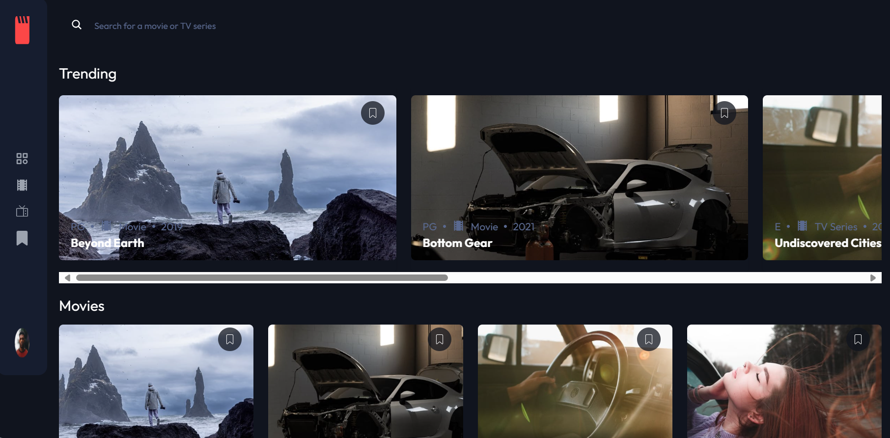

# Frontend Mentor - Entertainment web app solution

This is a solution to the [Entertainment web app challenge on Frontend Mentor](https://www.frontendmentor.io/challenges/entertainment-web-app-J-UhgAW1X). Frontend Mentor challenges help you improve your coding skills by building realistic project.

### The challenge

Users should be able to:

- View the optimal layout for the app depending on their device's screen size
- See hover states for all interactive elements on the page
- Navigate between Home, Movies, TV Series, and Bookmarked Shows pages
- Add/Remove bookmarks from all movies and TV series
- Search for relevant shows on all pages
- **Bonus**: Build this project as a full-stack application
- **Bonus**: If you're building a full-stack app, we provide authentication screen (sign-up/login) designs if you'd like to create an auth flow

### Screenshot

### Links

- Solution URL: [Github](https://github.com/Kiunga1/Entertainment-web-app)
- Live Site URL: 

## My process

### Built with

- Semantic HTML5 markup
- CSS custom properties
- Flexbox
- CSS Grid
- Mobile-first workflow
- [React](https://reactjs.org/) - JS library
- [Tailwind CSS](https://tailwindcss.com/) - For styles

## Features

- **Navigation**: Users can navigate between different pages including Home, Movies, TV Series, and Bookmarked Shows pages.
- **Search Functionality**: Users can search for relevant shows by title or genre.
- **Bookmarking**: Users can add/remove bookmarks from all movies and TV series.
- **Bookmarked Page**: Users can view all their bookmarked movies and TV series on a separate page.
- **Responsive Design**: The web application is responsive and works well on various devices.

## Author

- Frontend Mentor - [Ann Mukami](https://www.linkedin.com/in/ann-mukami/)
- LinkedIn - [@Kiunga1](https://www.frontendmentor.io/profile/Kiunga1)
